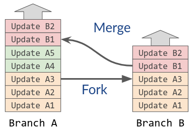
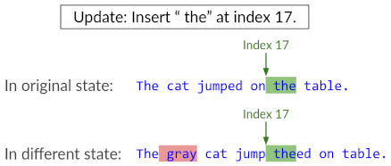
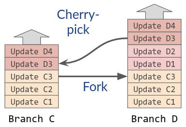

# Git Rich Text

Collaborative rich text editing over git, with conflict-free (GDocs-style) merging and cherry-picking.

Made with [list-positions](https://github.com/mweidner037/list-positions#readme) / [@list-positions/formatting](https://github.com/mweidner037/list-positions-formatting#readme), [Quill](https://quilljs.com/), and Electron.

## Demos

### Merge

https://github.com/mweidner037/git-rich-text/assets/17693586/d436b55d-1537-4438-90b9-fda71dc0fca2

### Cherry-pick

https://github.com/mweidner037/git-rich-text/assets/17693586/18558d26-4b30-4021-b922-bbf9c0f86461

## How It Works

The editor autosaves whenever it loses focus. Instead of saving the rich text directly, though, the file stores an append-only log of updates, one per line. Store this file in git; then each git commit describes a sequence of updates to add to the log.

You can use git to move these updates around in the usual way. E.g., merging branch B into branch A appends all of branch B's (new) updates to branch A's log:



(Git's default merge algorithm almost does this correctly, but to make it more reliable, I provide a custom merge driver - see [Usage](#usage) below.)

The catch is that updates are being applied to a different state than they originally intended. The updates must be designed to "make sense" despite this change of context. For example, it would **not** make sense to describe text edits in terms of ordinary indices:



Luckily, [list-positions](https://github.com/mweidner037/list-positions#readme) and [@list-positions/formatting](https://github.com/mweidner037/list-positions-formatting#readme) let us define rich-text updates that do make sense, by borrowing ideas from [CRDTs](https://crdt.tech/).

### Cherry-Picking

Cherry-picking is similar to merging: the custom merge driver appends all of the cherry-picked commit's updates to the target log.



For annoying technical reasons, this doesn't work out-of-the-box for rich text - one commit's updates might depend on [metadata](https://github.com/mweidner037/list-positions?tab=readme-ov-file#managing-metadata) from prior commits that were skipped over. I work around this by storing the metadata in special `"meta ..."` lines, which the merge driver appends even if they weren't part of the cherry-picked commit.

## Usage

Install with `npm i`.

Build in dev mode with `npm run build`.

Run in dev mode with `npm start <save file name>.clog`. The save file will be created if it doesn't exist. It must have a `.clog` extension.

### Git Config

The repo comes with a custom merge driver for the app's `.clog` save files. It implements the merge and cherry-pick logic described above, with no conflicts. The merge driver treats each file as an append-only log of lines and does nothing fancy (in particular, it is not a CRDT merge function or [Operational Transformation](https://en.wikipedia.org/wiki/Operational_transformation) algorithm).

To register the merge driver in a git repo:

1. Commit a `.gitattributes` file to the repo with content:
   ```
   *.clog merge=clog
   ```
2. Within the repo, run the following commands to configure your _local_ git (note: collaborators will need to repeat on their own devices):
   ```bash
   export CLOG_DIR=~/repos/git-rich-text # TODO: Replace with where you cloned the git-rich-text repo.
   git config merge.clog.driver "node ${CLOG_DIR}/build/scripts/scripts/git_merge_driver.js %A %O %B"
   git config merge.clog.name "git-rich-text clog file merger"
   ```

### Local Editing

After starting the editor with `npm start <save file name>.clog`, use it normally. Like VSCode, it autosaves whenever the window loses focus, and it reloads the doc from disk whenever the file changes (e.g., after `git checkout`).

You can `git commit`, `git branch`, and `git checkout` as normal.

Merge, cherry-pick, and rebase should work basically as expected. Note that these alway apply the incoming updates "on top" of the target branch, appending them to the log. So merging A into B gives a different log order than merging B into A. (Currently, this does not lead to different rich-text states, but it may in the future.)

### Remote Branches

To sync with a remote branch in a conflict-free way, do `git pull --rebase` and then `git push`. (The `--rebase` ensures that your local updates are applied "on top" of the remote branch: you and your collaborators are appending to the remote log together, not inserting into the middle.)

I don't know how to configure a custom merge driver for GitHub PRs. Instead, locally rebase on top of the target branch just before merging, so that it's a fast-forward on GitHub's end.

## References

- Architecture and diagrams: Section 4 of my [PhD thesis proposal](https://mattweidner.com/assets/pdf/thesis_proposal.pdf)
- Configuring a git merge driver: [git-json-merge](https://github.com/jonatanpedersen/git-json-merge)
